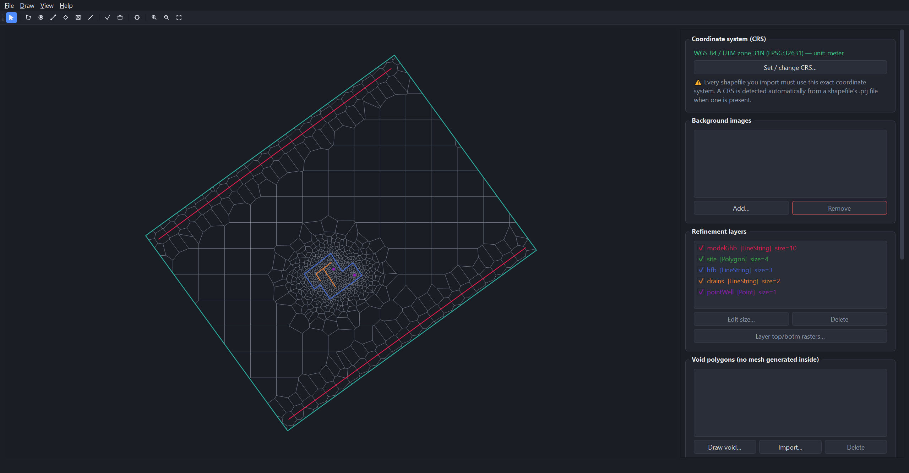
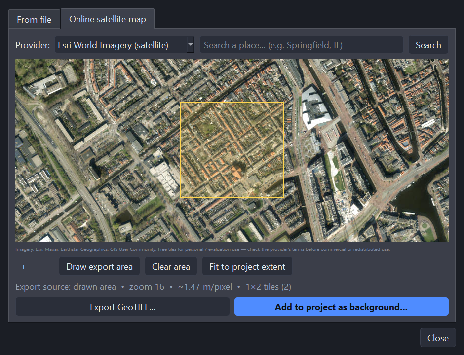

# mf6Voronoi Studio

[](LICENSE.txt)


A desktop **GUI to graphically create, edit, refine and export MODFLOW 6 DISV
Voronoi meshes**, built on top of the
[`mf6Voronoi`](https://github.com/hatarilabs/mf6Voronoi) package by Hatari Labs.

Import or draw the model limit and refinement features, control the progressive
refinement multiplier, generate the Voronoi mesh, review a cell-count/quality
report, and export to an ESRI Shapefile, DISV JSON, or a **ModelMuse-importable
MODFLOW 6 model** (with optional per-layer top/botm rasters).



---

## What's new in 3.0.0

* **Online satellite imagery**: the background-image dialog now has a second
  tab — pan and zoom a free satellite/aerial basemap (Esri World Imagery or
  Sentinel-2 Cloudless), search for a place or fit to your project extent,
  optionally drag out the exact area you need, then **add it straight to the
  project** or **export it as a georeferenced GeoTIFF** (reprojected into the
  project's CRS, or an auto-detected UTM zone) to keep and re-import later.

  

* **Fixed**: a packaging bug where `pyproj` and `rasterio` could ship
  mismatched bundled PROJ databases in the frozen executable, crashing any
  code path that resolves a CRS through `rasterio` (surfaced by the imagery
  feature above). The app now picks the newest bundled `proj.db` at startup
  instead of assuming one specific package's copy.

<details>
<summary>Earlier releases (2.0.x)</summary>

* **2.0.5** — Fixed: refinement features closer to the model boundary than
  their own target cell size (e.g. a GHB line running along the domain edge)
  got zero refinement applied, with no warning. Worked around by meshing
  against a temporarily expanded limit, then clipping back to the real one.
* **2.0.4** — The mesh-finished notification now also shows a guaranteed
  in-app popup, since Windows can suppress toast notifications from unsigned
  apps.
* **2.0.3** — Multiple background images (each with its own visibility
  toggle), a mesh-finished system notification, and About-dialog credits.
* **2.0.2** — A measure-distance tool, "Save project as…", and an
  unsaved-changes prompt.
* **2.0.1** — Void polygons (holes with no mesh generated inside), fixed
  refinement points shrinking to invisible at large zoom-outs, and a
  "Show generated mesh" toggle.
* **2.0.0** — Rebuilt the map canvas on a native Qt `QGraphicsView`, a
  reworked `ui/` package, a dark theme, and selectable/removable background
  images.

</details>

---

## What it does

| Requirement | How the app delivers it |
|---|---|
| Create / edit / export a DISV Voronoi grid | Generate with `mf6Voronoi`, edit layers live, export shapefile / DISV / ModelMuse |
| Export to ModelMuse | Writes a full MODFLOW 6 DISV simulation (FloPy) you import in ModelMuse |
| Handle layers | Unlimited refinement layers, each with its own target cell size, visibility & colour |
| Import shapefiles | Model limit polygon + point / line / polygon refinement shapefiles |
| Background imagery | Local GeoTIFF/PNG/JPG, **or** an online satellite basemap fetched and georeferenced automatically |
| Single CRS, metres or feet | The CRS and its length unit are validated; mismatched inputs are blocked |
| Refine with points, polygons, polylines | Import **or draw** them interactively on the map |
| Progressive refinement multiplier | Persistent options panel: coarse size, multiplier, overlapping, short-edge fix |
| Point-cloud summary | Streamed live into the Log panel during generation |
| Output as polygon ESRI Shapefile | One-click export (with `.prj` CRS) |
| Save / load projects | Full session saved to a single `.mf6vor` file (mesh included) |
| Cell-count / quality report panel | Live table of counts, cell-area stats, edge lengths; export CSV/JSON |
| Per-layer top/botm rasters | ModelMuse export samples GeoTIFFs at each cell centroid |
| Standalone executable | Build a Windows `.exe`, a portable ZIP, or an installer — no Python to run |

---

## Prerequisite: Python (for building / running from source)

Install **Python 3.10–3.12 (64-bit)** from
<https://www.python.org/downloads/windows/> and **tick "Add python.exe to
PATH"**.

> If Windows shows *"Python was not found… Microsoft Store"*, real Python isn't
> installed yet. Install it as above (and, if needed, turn off the Store aliases
> under *Settings → Apps → Advanced app settings → App execution aliases*). On
> Windows, double-click **`CHECK_PYTHON.bat`** to confirm, then run
> **`build_windows.bat`**. See `INSTALL_WINDOWS.txt`.

## Install (from source)

```bash
pip install -r requirements.txt
python mf6voronoi_gui.py
```

> `mf6Voronoi` pins `numpy<2.2.5`. If a dependency upgrades numpy, re-pin it:
> `pip install "numpy<2.2.5"`.

> **Building a standalone `.exe` or installer?** Do it from a clean virtual
> environment (`python -m venv .venv`, then install only
> `requirements.txt` + `pyinstaller` into it) rather than a general-purpose
> Python install — PyInstaller bundles *every* importable package it can see,
> and an environment with unrelated projects installed produces a much larger
> executable than necessary. `build_windows.bat` already does this for you.

The `Example/` folder ships a ready-to-use set of shapefiles and rasters (model
limit, refinement layers, background rasters) so you can follow the Quick
Start Guide below without preparing your own data first.

## Documentation

* [`docs/manual/mf6VoronoiStudio-3.0.0-Quick-Start-Guide.pdf`](docs/manual/mf6VoronoiStudio-3.0.0-Quick-Start-Guide.pdf)
  ([Guía de Inicio Rápido](docs/manual/mf6VoronoiStudio-3.0.0-Guia-de-Inicio-Rapido.pdf)) —
  a single walkthrough using the `Example/` folder, start to finished mesh.
* [`docs/manual/mf6VoronoiStudio-3.0.0-User-Manual.pdf`](docs/manual/mf6VoronoiStudio-3.0.0-User-Manual.pdf)
  ([Manual de Usuario](docs/manual/mf6VoronoiStudio-3.0.0-Manual-de-Usuario.pdf)) —
  the full reference manual, screenshot-by-screenshot.

Editable `.docx` sources and the doc-build pipeline live alongside the PDFs in
`docs/manual/` — see `docs/manual/README.md`.


## Typical workflow

1. **Set the CRS** (projected, metres or feet — e.g. EPSG `32612` or `2926`).
2. **Define the model limit** (import a polygon shapefile or draw it).
3. **Add refinement layers** (import shapefiles or draw points/lines/polygons),
   each with a target cell size.
4. *(Optional)* **Background image** — a local file, or fetch a satellite
   basemap online.
5. **Set the Voronoi refinement options**, then **Generate the mesh**.
6. **Review the cell-count / quality report** (auto-fills; save as CSV/JSON).
7. **Export**: mesh shapefile, DISV JSON, or a ModelMuse MODFLOW 6 model.
8. **Save the project** as a `.mf6vor` file.

### ModelMuse export (with per-layer rasters)
Each surface — the model **top** and every **layer bottom** — can be a constant
**or** a raster (sampled at each cell centroid). In ModelMuse:
*File → Import → Import MODFLOW-6 Model…* → select **`mfsim.nam`**.

---

## Files

| File | Purpose |
|---|---|
| `mf6voronoi_gui.py` | Thin entry point: builds the `QApplication`, applies the theme, shows the main window. |
| `ui/` | The PyQt5 application: `theme.py` (palette/QSS/icons), `canvas.py` + `scene_items.py` (the `QGraphicsView` map), `dialogs.py`, `online_imagery.py` (satellite basemap tab), `main_window.py`. |
| `mf6voronoi_bootstrap.py` | Stubs `pyvista`/VTK when absent so `import mf6Voronoi` stays light. |
| `version.py` | Single source of truth for the app version, used by the build scripts. |
| `mf6voronoi.ico` | App icon. |
| `Example/` | Sample shapefiles/rasters used throughout the manual and Quick Start Guide. |
| `docs/manual/` | User manual and Quick Start Guide sources + built PDF/DOCX (English & Spanish). |
| `requirements.txt` / `LICENSE.txt` | Dependencies + license. |

## Notes & limitations
* All inputs must share **one projected CRS** in **metres or feet**.
* The model limit must be **exactly one** single-part polygon.
* Multipart refinement features are exploded to single parts on import.
* The online satellite imagery providers are free for personal/evaluation
  use with no API key required; review each provider's terms before using
  exported imagery commercially or redistributing it.

## License

[GNU GPL v3](LICENSE.txt). This application bundles PyQt5, which Riverbank
Computing licenses under GPL v3 for free/open-source use; distributing the
whole application under GPL v3 is what keeps that legal. The underlying
[`mf6Voronoi`](https://github.com/hatarilabs/mf6Voronoi) package it drives
is separately MIT licensed by Hatari Labs.

## Credits

* [`mf6Voronoi`](https://github.com/hatarilabs/mf6Voronoi) meshing engine — Saul Montoya, Hatari Labs
* GUI — An Ho Taylor

*Viva el Software Libre*
